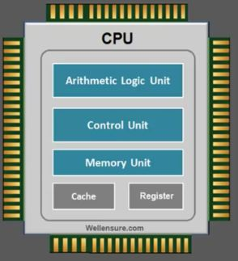
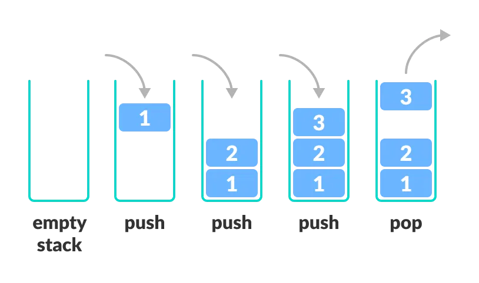
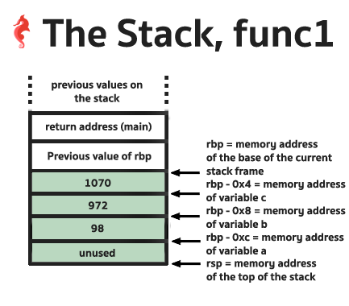
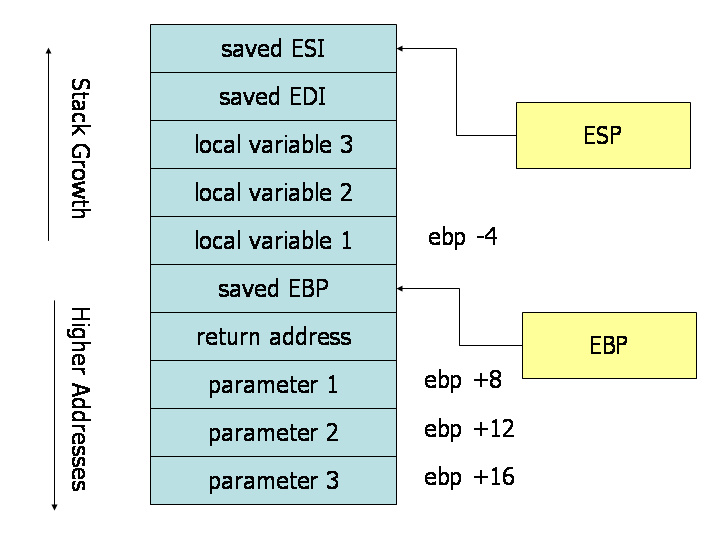

# Antes de tudo

Primeiramente, o que é Engenharia Reversa? Engenharia reversa é o ato de abrir arquivos binários e dissecá-los, de modo a entender como eles funcionam. Isto nos permite aprender muitas coisas sobre como os programas realmente funcionam por trás dos panos, além de entender as vulnerabilidades associadas a isto (o que é o mais divertido, convenhamos).

Engenharia Reversa é muito prático, mas exige um conhecimento robusto, pois você estará lidando com arquivos binários. Qualquer bit a mais poderá facilmente causar problemas.

Assim, antes de definitivamente começarmos a praticar Engenharia reversa, precisamos de um tutorial sobre alguns conceitos e ferramentas importantes.


# 2. Assembly

## 2.1. O que é Assembly?

Assembly ou linguagem de montagem é uma **linguagem de programação**, assim como C, Python, JavaScript, etc. Porém se destaca por ser a linguagem mais próxima do código que o processador realmente executa. O C abstrai muitas das operações.

Tome como exemplo a operação de declarar uma variável no C: `int a = 10`. Você acha mesmo que o processador apenas recebe isso e já tem um lugar pronto para a variável `a`, uma caixinha onde é guardado 10? Não, muito longe disso. Uma série de operações que o processador realmente executa são escondidas de você, para simplificar o trabalho do programador.

Algumas linguagens de programação abstraem mais do que outras. O Assembly é **muito próximo do código de máquina, muito verboso**. O C já abstrai mais, mas é rígido e permite manipulação de memória. Já o Python seria o "nível mais fácil" das linguagens de programação, pois tem inúmeras funcionalidades prontas que facilitam seu trabalho.

Podemos ver isso com a operação de soma de dois números.

Código de máquina:
```Bin
01001000 11000111 11000111 00000101 00000000 00000000 00000000
01001000 11000111 11000110 00000011 00000000 00000000 00000000
01001000 00000001 11110111
```
Código de máquina em hexadecimal (cada número representa 1 byte):
```hex
48 c7 c7 05 00 00 00 48 c7 c6 03 00 00 00 48 01 f7
```
Código em Assembly:
```Assembly
mov rdi, 0x5
mov rsi, 0x3 
add rdi, rsi
```
Código em C:
```C
int a = 5;
int b = 3;
int resultado = a + b;
```
Código em Python:
```py
resultado = 5 + 3
```

Não há linguagem de programação melhor do que outra, apenas aquela que é uma ferramenta boa para você. Python oferece agilidade, enquanto C oferece otimização e robustez, ao passo que Assembly é próxima do código de máquina, útil para otimização e também análise de Engenharia Reversa, como veremos aqui.

O Assembly possui **acesso direto ao hardware**, de modo que permite manipular diretamente os registradores da CPU (falaremos mais à frente sobre isso). Cada instrução (linha) de um código Assembly geralmente corresponde a uma única instrução de máquina, assim temos uma proporção 1:1, algo que não acontece no C e Python.

## 2.2 Por quê Assembly?

Todo código, qualquer que seja a linguagem, é compilado e transformado em código de máquina. Engenharia reversa é a arte de abrir esses binários e entendê-los, e para isso precisamos entender a sintaxe do Assembly, pois ela torna o código de máquina legível.

Além disso, as vulnerabilidades que são exploradas aqui e em CTF's não podem ser exploradas só convertendo o código de volta para C, precisamos explorar o Assembly do código, ver como a stack se organiza, etc.

## 2.3 Registradores

Registradores são **locais de memória temporária dentro do processador**. Eles possuem uma **quantidade pequena de memória**, em geral 8 bytes, mas possuem **alta velocidade de acesso e operação** (muito mais rápido que memḿoria RAM).

Basicamente, os registradores são utilizados para armazenar informação útil, como valores de variáveis, endereços de memória para outros lugares (ponteiros), etc. Os registradores sempre estarão presentes em código assembly, pois enviar valores diretamente para registradores no processador é o modo mais otimizado de se realizar uma operação.



Na **arquitetura x64 (64 bits = 8 bytes)**, os registradores da CPU do computador **possuem 8 bytes cada**. Na arquitetura x86 (32 bits = 4 bytes), os registradores possuem 4 bytes cada. Cada programa **.exe** (ou qualquer outra extensão em código de máquina) segue uma dessas duas arquiteturas.

Abaixo, temos uma lista de registradores e do modo como cada um é usado em um programa.

| 8 Byte Register | Lower 4 Bytes | Lower 2 Bytes | Lower Byte | Uso principal |
|-----------------|---------------|---------------|------------|---------------|
|   rbp           |     ebp       |     bp        |     bpl    |Base Pointer (Ponteiro de Base do Frame da Pilha)|
|   rsp           |     esp       |     sp        |     spl    |Stack Pointer (Ponteiro do Topo da Pilha)
|   rip           |     eip       |     (N/A)          |   (N/A)         |Instruction Pointer (Ponteiro da Próxima Instrução)
|   rax           |     eax       |     ax        |     al     |Acumulador (Valor de Retorno, Operações Aritméticas)
|   rbx           |     ebx       |     bx        |     bl     |Base (Ponteiro de Dados, Valor Preservado em Chamadas)
|   rcx           |     ecx       |     cx        |     cl     |Contador (Contador para Loops/Shifts, 3º Argumento)
|   rdx           |     edx       |     dx        |     dl     |Dados (Extensão do Acumulador, 4º Argumento)
|   rsi           |     esi       |     si        |     sil    |Source Index (Ponteiro Fonte para Operações de String/Memória, 2º Argumento)
|   rdi           |     edi       |     di        |     dil    |Destination Index (Ponteiro Destino para String/Memória, 1º Argumento)
|   r8            |     r8d       |     r8w       |     r8b    |5º Argumento de Função (Uso Geral)
|   r9            |     r9d       |     r9w       |     r9b    |6º Argumento de Função (Uso Geral)
|   r10           |     r10d      |     r10w      |     r10b   |Temporário (Uso Geral, Não Preservado em Chamadas)
|   r11           |     r11d      |     r11w      |     r11b   |Temporário (Uso Geral, Não Preservado em Chamadas)
|   r12           |     r12d      |     r12w      |     r12b   |Local (Uso Geral, Preservado em Chamadas)
|   r13           |     r13d      |     r13w      |     r13b   |Local (Uso Geral, Preservado em Chamadas)
|   r14           |     r14d      |     r14w      |     r14b   |Local (Uso Geral, Preservado em Chamadas)
|   r15           |     r15d      |     r15w      |     r15b   |Local (Uso Geral, Preservado em Chamadas)

## 2.4 Flags

**Existe um registrador que contém flags**, o **RFLAGS** (x64 = 64 bits) ou **EFLAGS** (x86 = 32 bits). Cada bit do registrador é uma flag diferente.

| Bit | Flag|
|-----|-----|
|00   | Carry Flag
|01|     always 1
|02|     Parity Flag
|03|     always 0
|04|     Adjust Flag
|05|     always 0
|06|     Zero Flag
|07|     Sign Flag
|08|     Trap Flag
|09|     Interruption Flag     
|10|     Direction Flag
|11|     Overflow Flag
|12|     I/O Privilege Field lower bit
|13|     I/O Privilege Field higher bit
|14|     Nested Task Flag
|15|     Resume Flag

Esse registrador é usado, por exemplo, para a operação de comparar se dois números são iguais. Para verificar se `a > b`:

-  `cmp a, b` (instrução assembly)
    - Faz a - b
    - Se dá zero, **Zero Flag** (bit 06) fica como `1`.
    - Se dá diferente de zero, **Zero Flag** (bit 06) fica como `0`.
        - Se dá negativo, **Sign Flag** (bit 07) fica como `1`
        - Se dá positivo, **Sign Flag** (bit 07) fica como `0`
- Resultado da subtração é descartado, mas as Flags são utilizadas como referência para os próximos passos.

Isso sempre irá ocorrer quando houver um IF/ELSE no código original.

## 2.5 Instruções Assembly comuns

### Words

Words não são comandos, mas indicam o tamanho do tipo de dado em Assembly.

- WORD = **2 bytes de dados**.
- DWORD = **4 bytes de dados**.
- QWORD = **8 bytes de dados**.

### Comentários

Para comentários, usa-se `;`

### mov

**Move dados de um registrador para outro** (segundo para o primeiro). 

Ex: `mov rax, rdx` (move dados de rdx para rax)

### dereference

**colchetes [ ] referenciam dados ao qual um ponteiro aponta**. Ou seja, se `RBP-0x8` = `0xfffff72c` (endereço), então `[RBP-0x8]` = 10 (valor da variável).

Ex: `mov rax, [rdx]`

### lea

**Calcula o endereço do segundo operando**, e move para o primeiro.

Ex: `lea rdi, [rbx+0x10]` (move o endereço rbx+0x10 para o registrador rdi)

### add

**Adiciona dois valores** e armazena no primeiro operando.

Ex: `add rax, rdx` (rax = rax + rdx)

### sub

**Subtrai o segundo operando do primeiro** e armazena no primeiro.

Ex: `sub rsp, 0x10` (`rsp` = `rsp` - `0x10`)

### xor

**Faz o xor nos dois argumentos**, e armazena no primeiro operando. and e or são semelhantes.

Ex: `xor rdx, rax`

### push

**Cresce a stack em 8 ou 4 bytes** (para x64, ou 4 para x86), **depois** **adiciona o conteúdo do registrador para o topo da stack**

Ex: `push rax`

### pop

Tira 8 bytes do topo da stack e armazena no argumento. Depois encolhe a stack.

Ex: `pop rax` (Retira dado do topo da Stack e armazena em RAX)

### jmp

**Pula para um endereço de instrução**. Redireciona a execução do código.

Ex: `jmp 0x60201012`

É uma redução de código, e é igual a:

`mov RIP, 0x60201012`

(Alterar o RIP altera onde o código estará sendo executado)

### call

É uma redução de dois comandos. Utilizado sempre que se chama uma função no código.

1. `push RIP` - empilha Return Address na stack. É o endereço de retorno da PRÓXIMA instrução a ser executada na função atual quando a nova função retornar.
2. `jmp function`- Salta para as linhas de instrução da nova função.

### ret

Depois que a função finaliza, **a instrução `ret` é chamada**. Ela consiste em uma redução de comando:

`pop RIP` - Desempilha topo da stack (que deve ser o return address) e coloca no RIP (registrador que guarda o endereço de onde está sendo executado código)

Você pode se perguntar: Mas o topo da stack não tem as variáveis, RBP antigo, etc? Sim, exato. Por isso, antes da função finalizar, temos ajustes na stack:

```assembly
mov RBP, RSP ; RSP (topo da stack) agora é RBP, que contém endereço do RBP da função anterior 
pop RBP ; Faz o pop, restaurando o endereço do RBP da função anterior
ret
```

E o que acontece com as variáveis e todas as outras coisas que estavam na stack da função? Ficam lá, como lixo de memória, sem serem modificadas, até que um programa sobrescreva elas.

### cmp

**Compara dois operandos, faz o primeiro menos o segundo e checa se o resultado é maior/menor/igual a zero**. Dependendo do valor, define uma flag de acordo.

Ex: `cmp RAX, 0x10`

### jnz/jz (jumpt if not zero/jump if zero)

Similar ao `jmp`. Mas apenas executa dependendo do status da zero flag.

Existem outros, como `jle` (jump if less or equal).

## 2.6 Stack em Arquitetura de programas (Pilha)

### 2.6.1 Conceito de Stack

A stack é um conceito simples de Estrutura de Dados. Consiste apenas em uma ideia de como organizar informação. Imagine que você possui um tubo onde você pode colocar bolinhas, somente pelo topo. Se você enxer o tubo, para retirar bolinhas, você precisará começar a remover pelas bolinhas mais recentes que você colocou.

A Stack é basicamente isso. Começamos a resolver, ou **desempilhar** as coisas começando das mais recentes para as mais antigas. Na Stack, **o último será o primeiro**.

A stack é uma estrutura de dados com duas operações: push e pop.

- `push` - Coloca novo valor no topo da stack
- `pop` - Remove valor do topo da stack e extrai seu valor



Imagine agora que temos uma função que chama outra função, e esta função chama outra função. **Função > Função >  Função**. Quando a ultima função retorna, devemos começar a resolver as coisas pela primeira função? Não. Vamos resolvendo pela ordem inversa, até que a segunda retorne na primeira, e a primeira conclua sua execução.

```C
int function1(int n){
    return function2(n) + 1;
}
int function2(int n){
    return function3(n) + 1;
}
int function3(int n){
    return n + 1;
}

int main(){
    int result = function1(10);

    return 0;
}
```

Dessa forma, o conceito de Stack é utilizado na arquitetura de programas para organizar o fluxo do programa e o escopo de funções.

### 2.6.2 Stack para Assembly

A stack é uma **região contínua de memória no computador onde as variáveis locais serão armazenadas**. Ela é uma estrutura de dados com duas operações: **PUSH** (adicionar valor ao topo) e **POP** (retirar valor do topo).

No assembly:
- Instrução `push` - **Empilha** valor na stack
- Instrução `pop` - **Desempilha** valor na stack
- Registrador `RSP` - Possui ponteiro para **topo da stack** (endereço do último bloco de memória correspondente à stack)
- Registrador `RBP` - Possui ponteiro para a **base da stack** (endereço do primeiro bloco de memória correspondente à stack)

Na memória, **o topo da pilha "cresce negativamente"**. Assim, sempre que um valor é empilhado na stack, o valor de esp é decrescido.

Lembre-se que **RSP e RBP NÃO ESTÃO NA STACK, eles são apenas ponteiros**, ou seja, contém os endereços que são a base e o topo da stack.

A stack contém 4 elementos básicos, nesta ordem:

1. **Parâmetros** da **função atual** (isto acontece apenas se houverem mais parâmetros do que a quantidade de registradores disponíveis. **Caso contrário, os parâmetros são passados pelos registradores** `rdi`, `rsi`, `rdx`)
2. **Endereço de retorno** para continuar a partir da **função antiga** (ou seja, a próxima instrução após a chamada da nova função)
```C
int main(){ 
    imprimir_soma(1, 2);
    int a  = 0; // Return Address é um ponteiro para essa instrução, depois da chamada de função
    return 0;
}
```
3. **RBP** da **função antiga** (ou seja, a função que chamou a função atual. Afinal, alguma hora iremos retornar para ela, e voltar a trabalhar com as variáveis locais dela, que ainda estarão armazenados na stack, certo?)
4. **Variáveis locais** da **função atual**



Um ponto importante é que, no código assembly, **todos os dados presentes na stack são acessados com base no RBP** (RBP-0x4 = Endereço para o qual RBP aponta acrescentado de 4 bytes).

(Lembre-se que, quando mais alto o valor na pilha, ou seja, quanto mais próximo de RSP, mais decrescemos o valor de RBP, pois a stack cresce negativamente)

### 2.6.3 Exemplo de Uso de Stack

Abaixo, temos um código em C e uma simulação de como eles estariam na stack.

Código em **C**:

```C
// Compilado para arquitetura x86 (32 bits) com otimização mínima (ex: -O0)

void simple_function(int p1, int p2, int p3) {
    // Estas serão as Variáveis Locais 1, 2 e 3
    int local1 = p1 * 2;
    int local2 = p2 + 1;
    int local3 = p3 - 1;

    // Usar todas as variáveis garante que o compilador as crie na stack.
    local1 = local2 + local3;
}

int main() {
    // Chamada com 3 parâmetros
    simple_function(10, 20, 30);
    return 0; // Return address da simple_function aponta para aqui (chamada + 1)
}
```

Código em **Assembly**:

```assembly
asm
section .text
    global simple_function
    global main

; int simple_function(int p1, int p2, int p3)
simple_function:
    ; Prólogo
    push rbp
    mov rbp, rsp

    ; local1 = p1 * 2
    mov eax, edi        ; Copia p1 (EDI) para EAX
    shl eax, 1          ; Deslocamento de bits para a esquerda (multiplica por 2)
    ; local1 fica armazenado em EAX

    ; local2 = p2 + 1
    mov ebx, esi        ; Copia p2 (ESI) para EBX
    add ebx, 1          ; Adiciona 1 de EBX

    ; local3 = p3 - 1
    mov ecx, edx        ; Copia p3 (EDX) para ECX
    sub ecx, 1        ; Subtrai 1 de ECX

    ; local1 = local2 + local3
    mov eax, ebx        ; Copia local2 para EAX (EAX é sobrescrito)
    add eax, ecx        ; Adiciona ECX de EAX (local2 + local3)

    ; Epílogo
    pop rbp        ; Desempilha valor do RBP da função anterior salva
    ret        ; Retorna

; int main()
main:
    ; Prologue
    push rbp
    mov rbp, rsp

    ; Call simple_function(10, 20, 30)
    mov edi, 10
    mov esi, 20
    mov edx, 30
    call simple_function

    ; Return 0
    mov eax, 0

    ; Epilogue
    pop rbp
    ret
```

**Stack** ao entrar na função simple_function:



Perceba que a Stack está de 4 em 4 bytes (arquitetura x86 = 32 bits). Também perceba que localizamos as variáveis com base no RBP: 

- **[EBP+16]** = parâmetro p3
- **[EBP+12]** = Parâmetro p2
- **[EBP+8]** = Parâmetro p1
- **[EBP+4]** = Endereço de retorno
- **[EBP]** = Valor do EBP da função anterior
- **[EBP-4]** = local1 
- **[EBP-8]** = local2
- **[EBP-12]** = local3

## 2.7 Assembly na prática

Começaremos com alguns problemas básicos de Engenharia Reversa de Assembly.

Os problemas são do repositório: [kablaa-CTF-Workshop](https://github.com/kablaa/CTF-Workshop/blob/master/Reversing/Challenges/IfThen/if_then).

### Hello World

Arquivo: [hello_word](./reversing-assembly/hello_world)

Em Linux, podemos usar o seguinte comando para olhar o código em Assembly: 

```
$    objdump -D hello_world -M intel | less
```

Depois de procurar pela string `main` (que é a função principal), vemos isso:

```assembly
080483fb <main>:
 80483fb:       8d 4c 24 04             lea    ecx,[esp+0x4]
 80483ff:       83 e4 f0                and    esp,0xfffffff0
 8048402:       ff 71 fc                push   DWORD PTR [ecx-0x4]
 8048405:       55                      push   ebp
 8048406:       89 e5                   mov    ebp,esp
 8048408:       51                      push   ecx
 8048409:       83 ec 04                sub    esp,0x4
 804840c:       83 ec 0c                sub    esp,0xc
 804840f:       68 b0 84 04 08          push   0x80484b0
 8048414:       e8 b7 fe ff ff          call   80482d0 <puts@plt>
 8048419:       83 c4 10                add    esp,0x10
 804841c:       b8 00 00 00 00          mov    eax,0x0
 8048421:       8b 4d fc                mov    ecx,DWORD PTR [ebp-0x4]
 8048424:       c9                      leave  
 8048425:       8d 61 fc                lea    esp,[ecx-0x4]
 8048428:       c3                      ret    
 8048429:       66 90                   xchg   ax,ax
 804842b:       66 90                   xchg   ax,ax
 804842d:       66 90                   xchg   ax,ax
 804842f:       90                      nop
```

Olhando para o código, vemos uma function call para `puts`:

```assembly
push   0x80484b0
call   80482d0 <puts@plt>
```

O resto do código não possui nada muito interessante por agora.

### If Then

Começamos vendo o código em assembly com `objdump`:

```
$    objdump -D if_then -M intel | less
```

Após o comando, procuramos pela função main:

```assmebly
080483fb <main>:
 80483fb:       8d 4c 24 04             lea    ecx,[esp+0x4]
 80483ff:       83 e4 f0                and    esp,0xfffffff0
 8048402:       ff 71 fc                push   DWORD PTR [ecx-0x4]
 8048405:       55                      push   ebp
 8048406:       89 e5                   mov    ebp,esp
 8048408:       51                      push   ecx
 8048409:       83 ec 14                sub    esp,0x14
 804840c:       c7 45 f4 0a 00 00 00    mov    DWORD PTR [ebp-0xc],0xa
 8048413:       83 7d f4 0a             cmp    DWORD PTR [ebp-0xc],0xa
 8048417:       75 10                   jne    8048429 <main+0x2e>
 8048419:       83 ec 0c                sub    esp,0xc
 804841c:       68 c0 84 04 08          push   0x80484c0
 8048421:       e8 aa fe ff ff          call   80482d0 <puts@plt>
 8048426:       83 c4 10                add    esp,0x10
 8048429:       b8 00 00 00 00          mov    eax,0x0
 804842e:       8b 4d fc                mov    ecx,DWORD PTR [ebp-0x4]
 8048431:       c9                      leave  
 8048432:       8d 61 fc                lea    esp,[ecx-0x4]
 8048435:       c3                      ret    
 8048436:       66 90                   xchg   ax,ax
 8048438:       66 90                   xchg   ax,ax
 804843a:       66 90                   xchg   ax,ax
 804843c:       66 90                   xchg   ax,ax
 804843e:       66 90                   xchg   ax,ax
```

Podemos ver que o valor 0xa (10 em hexadecimal) é carregado em ebp-0xc:

```
mov    DWORD PTR [ebp-0xc],0xa
```

Imediatamente após isso, vemos que há uma instrução `cmp`, seguida de `jne`. Isso checa se é o dado presente em `ebp-0xc` é igual a 0xa. Se não for igual, `jne` irá pular para `main+0x2e` (obs: main+0x2e é a mesma coisa que pegar o endereço base da função main, ou seja, o endereço da primeira instrução, e acrescentar 0x2e a ele (46 em decimal))


Como o valor é igual, o jump não será executado:

```
cmp    DWORD PTR [ebp-0xc],0xa
jne    8048429 <main+0x2e>
```

Prosseguindo, é feita uma chamada para a função puts:

```
sub    esp,0xc
push   0x80484c0
call   80482d0 <puts@plt>
```

Após rodar o código, podemos rodá-lo e ver o que faz:

```
$    ./if_then
x = ten
```

### Loop

Começamos vendo o código em assembly com `objdump`:

```
$    objdump -D loop -M intel | less
```

Procurando pela função main, vemos isso:

```
080483fb <main>:
 80483fb:       8d 4c 24 04             lea    ecx,[esp+0x4]
 80483ff:       83 e4 f0                and    esp,0xfffffff0
 8048402:       ff 71 fc                push   DWORD PTR [ecx-0x4]
 8048405:       55                      push   ebp
 8048406:       89 e5                   mov    ebp,esp
 8048408:       51                      push   ecx
 8048409:       83 ec 14                sub    esp,0x14
 804840c:       c7 45 f4 00 00 00 00    mov    DWORD PTR [ebp-0xc],0x0
 8048413:       eb 17                   jmp    804842c <main+0x31>
 8048415:       83 ec 08                sub    esp,0x8
 8048418:       ff 75 f4                push   DWORD PTR [ebp-0xc]
 804841b:       68 c0 84 04 08          push   0x80484c0
 8048420:       e8 ab fe ff ff          call   80482d0 <printf@plt>
 8048425:       83 c4 10                add    esp,0x10
 8048428:       83 45 f4 01             add    DWORD PTR [ebp-0xc],0x1
 804842c:       83 7d f4 13             cmp    DWORD PTR [ebp-0xc],0x13
 8048430:       7e e3                   jle    8048415 <main+0x1a>
 8048432:       b8 00 00 00 00          mov    eax,0x0
 8048437:       8b 4d fc                mov    ecx,DWORD PTR [ebp-0x4]
 804843a:       c9                      leave  
 804843b:       8d 61 fc                lea    esp,[ecx-0x4]
 804843e:       c3                      ret    
 804843f:       90                      nop
```

Nessa função, podemos ver que é inicializada uma variável de stack em `ebp-0xc` como `0`, e depois pula para `0x804842c` (`main_0x31`):

```
mov    DWORD PTR [ebp-0xc],0x0
jmp    804842c <main+0x31>
```

Olhando para as instruções em `0x804842c` vemos isso:

```
cmp    DWORD PTR [ebp-0xc],0x13
jle    8048415 <main+0x1a>
```

Isso compara o valor da stakc em ebp-0xc contra 0x13 (19 em decimal), e se for menor ou igual então irá pular para `0x8048415` (`0x80483fb+0x1a`). Isso nos leva a uma call para uma função printf:

```
sub    esp,0x8
push   DWORD PTR [ebp-0xc]
push   0x80484c0
call   80482d0 <printf@plt>
```

Parece que isso está printando o coteúdo de `ebp-0xc` em algum tipo de format string. Depois disso podemos ver que o valor de `ebp-0xc` é incremendado, antes de fazer o `cmp` de novo:

```
add    DWORD PTR [ebp-0xc],0x1
```

Certo, juntando todas as peças, agora nós estamos provavelmente olhando para um loop for que vai rodar 20 vezes, e printar o contador de iteração em cada uma das iterações. Isso parece algo similar a:

```C
int i = 0;
for (i = 0; i < 20; i ++)
{
    printf("%d", i);
}
```

Quando rodamos o binário, vemos que isso é verdade:

```
$    ./loop
0 1 2 3 4 5 6 7 8 9 10 11 12 13 14 15 16 17 18 19
```

## 2.8 Tópico Adicional: Diretivas Assembly

Usamos assembly apenas para análise, mas ele pode ser trabalhado como se fosse uma linguagem de programação comum. Para compilar um código em assembly, temos o assembler.

Dado isto, temos as **diretivas** no código assembly, que não existem no executável final. Elas servem para guiar o Assembler na compilação do código:

```
Assembly Source (.s) → Assembler → Object File (.o) → Linker → Executable (.exe)
     ↓                    ↓              ↓               ↓          ↓
  [DIRETIVAS]        [PROCESSADAS]   [REMOVIDAS]   [REMOVIDAS] [CÓDIGO PURO]
```

Abaixo temos uma lista de diretivas, e o que elas fazem:

```nasm
; Diretivas de Dados/Strings
.byte 0x48, 0x31, 0xc0    ; 3 bytes: 48 31 c0
.byte 'A','B','C'          ; Bytes ASCII: 41 42 43
.word 0x1234              ; 2 bytes: 34 12 (little-endian)
.short 255                ; 2 bytes: FF 00
.long 0x12345678          ; 4 bytes: 78 56 34 12
.int 0x41414141           ; 4 bytes: 41 41 41 41
.quad 0x4141414141414141  ; 8 bytes de 'A'
.quad 0x1234567890ABCDEF  ; 8 bytes qualquer
.ascii "Hello"            ; 48 65 6c 6c 6f (sem \0)
.ascii "flag.txt"         ; 66 6c 61 67 2e 74 78 74
.asciz "Hello"            ; 48 65 6c 6c 6f 00
.string "test"            ; 74 65 73 74 00

; Diretivas de Arquivos/Inclusão
.include "other.s"        ; Inclui código de other.s
.incbin "file.bin"        ; Insere bytes brutos de file.bin
.file "mysource.s"        ; Informa nome do arquivo fonte

; Diretivas de Seções/Organização
.section .text            ; Seção de código
.section .data            ; Seção de dados
.section .rodata          ; Seção de dados somente leitura
.text                    ; Mudar para .text
.data                    ; Mudar para .data  
.bss                     ; Mudar para .bss (dados não inicializados)
.global _start           ; _start visível externamente
.globl main              ; main visível externamente

; Diretivas de Alinhamento/Tamanho
.align 4                 ; Alinha para múltiplo de 4
.align 8                 ; Alinha para múltiplo de 8
.skip 100                ; 100 bytes de 0x00
.space 50, 0x41          ; 50 bytes de 'A'
.zero 64                 ; 64 bytes de 0x00

; Diretivas de Repetição
.rept 10
.byte 0x90               ; 10 bytes de NOP
.endr
.fill 100, 1, 0x41       ; 100 bytes de 'A'
.fill 50, 4, 0x90909090  ; 50 grupos de 4 bytes NOP

; Diretivas de labels/Símbolos
.set BUFFER_SIZE, 100
.equ SYS_EXIT, 60
.macro exit code=0
    mov rax, 60
    mov rdi, \code
    syscall
.endm

; Condicionais
.if 1 == 1
.byte 0x41
.else  
.byte 0x42
.endif

; Definir endereço atual
.org 0x400000            ; Define endereço atual

; Declarar variável comum
.comm buffer, 100        ; Variável global não inicializada
```

Um exemplo de uso:

```
.text
.global _start
.file "exploit.s"

_start:
    .align 8 ; Adiciona padding
    mov rax, 1 ; número 1 no registrador rax
    .byte 0x48, 0x31, 0xc0 ; Insere bytes
    .ascii "TEST" ; Insere string ("TEXT" = 0x54 0x45 0x53 0x54)
```

O executável final ficaria:

```
00000000: 48b8 0100 0000 0000 0000 4831 c054 4553  H.........H1.TES
00000010: 54                                        T
```

Perceba que:

- `48b8 0100` - mov rax, 1
- `4831 c0` - Bytes inseridos
- `54 4553 54` - String "TEXT"

`.file`, `.text` e `.global` sumiram.

## 2.8 Assembly CheatSheet

- **Registradores** - Memória no processador que armazena informação
    - `rbp`: Base Pointer, aponta para a **base do stack** frame atual
    - `rsp`: Stack Pointer, aponta para o **topo da stack** frame atual
    - `rip`: Instruction Pointer, aponta para a **instrução a ser executada**
    - Prefixos: `r` - 8 bytes. `e` - 4 bytes. `nada` - 2 bytes. Sufixo `l` - Lower byte
- Words
    - `word` - 2 bytes
    - `dword` - 4 bytes
    - `qword` - 8 bytes
- **Stack** - Região de memória com operações push/pop, onde variáveis locais são armazenadas. Cresce negativamente (topo é endereço menor, base é endereço maior).
- **Instruções**
    - `mov` - **Move dados de um registrador para outro** (segundo para o primeiro).
    - `dereference` - **colchetes [ ] referenciam dados ao qual um ponteiro aponta**.
    - `lea` - **Calcula o endereço do segundo operando**, e move para o primeiro.
    - `add` - **Adiciona dois valores** e armazena no primeiro operando.
    - `sub` - **Subtrai o segundo operando do primeiro** e armazena no primeiro.
    - `xor` - **Faz o xor nos dois argumentos**, e armazena no primeiro operando. and e or são semelhantes.
    - `push` - **Cresce a stack em 8 ou 4 bytes** (para x64, ou 4 para x86), **depois** **adiciona o conteúdo do registrador para o topo da stack.**
    - `pop` - Tira 8 bytes do topo da stack e armazena no argumento. Depois encolhe a stack.
    - `jmp` - **Pula para um endereço de instrução**. Redireciona a execução do código.
    - `call` - Redução dos comandos `push RIP` e `jmp function`. Utilizado sempre que se chama uma função.
    - `ret` - Redução do comando `pop RIP` (desempilha topo da stack para voltar para a execução de código antes da chamada de função, e atribui o valor do pop ao RIP).
    - `cmp` - **Compara dois operandos, faz o primeiro menos o segundo e checa se o resultado é maior/menor/igual a zero**. Dependendo do valor, **define uma flag** de acordo.
    - `jnz/jz` -  (jump if not zero/jump if zero) Similar ao jmp. Mas apenas **executa dependendo do status da zero flag**. Existem outros jumps.


# 3. Ghidra

Ghidra é um **decompilador open source** elaborado pela NSA. Um compilador pega um código qualquer, como C, e converte isso para códígo de maquina. Um decompilador tenta fazer o **oposto**. Ele **pega código de máquina e gera código que se aproxima do código-fonte original**. Porém, esse processo de decompilação não é como uma função 1:1, e o código dado nem sempre é 100% correto. Porém é de grandiosíśsima ajuda, e realmente reduz muito o tempo gasto em desafios de engenharia reversa.

Além do Ghidra, temos opções como IDA, porém o Ghidra é de graça e open-source.

Requer: **Java Development Kit (JDK)** e **Python3**.

## 3.1 Baixando

1. **Baixe o JDK** para x64
2. **Descomprima o arquivo** com `tar -xyf file.tar.gz`
3. **Baixe o zip do GHIDRA** e dê `unzip file`
4. Digite o comando `vi ~/.bashrc` - No fim do arquivo, adicione o diretório bin de JDK para a variável PATH: `export PATH=<path_JDK>/bin:$PATH`. Ache o caminho com para JDK com o comando `pwd`.
5. Digite `java --version` para testar.
6. Na pasta do ghidra, **rode o arquivo ghidraRun**

## 3.2 Usando

1. Crie um projeto em **New Project**
2. **File > Import File** (or drag and drop file)
3. **Importe o binário** que você quer analisar. Ao importar, clicar em **Ok**
4. Em **Tool Chest**, drag and drop file. Ou apenas dê um double-click no seu arquivo.
5. Se pedir para analisar, clique em **Yes**. Selecione opções desejadas e clique em **analyze** (Se desejar, apenas clique em analyze, pois as opções padrão já são de bom tamanho)


### Interface
- Em cima à esquerda, há a **Program Tree**. Mostra a estrutura de programas (que **foram separados de acordo com os blocos do arquivo compilado original**).
- À esquerda, há a **symbol tree**. Permite encontrar **símbolos** na navegação.
- Embaixo à esquerda, há o Data Type Manager. Permite **achar, aplicar e criar tipos de dados**.
- Aperte **'G'** para navegar para um endereço ou palavra.
- No meio, mostra a **visualização em assembly** do programa. Selecione linhas, e elas serão mostradas à direita, no **C decompiller**. Em qualquer lugar do Assembly que você clique, irá ser mostrado o mesmo código em C à direita (próximo do código original).

### Utilidades gerais
- Clique em uma variável e **aperte L para renomeá-la** (as variáveis do código fonte, ao serem compiladas, perdem seus nomes. Mas você pode dar nome às variáveis que está analisando no código)
- Clique em uma variável e **aperte Ctrl+L para renomear seu tipo** (o decompilador pode interpretar um `char` como um `int`, o que é até bem comum)

# 4. Debugging com GDB

GDB, um debbuger do GNU, é uma ótima ferramenta para **analisar binários em execução**, permitindo analisar o código em assembly, ler variáveis na memória, ler a stack, etc. É realmente essencial para se trabalhar com rev.

Normalmente, o combo é Ghidra + GDB: Abra o Ghidra para ter uma ideia do que o código faz e use o GDB para tentar explorar as vulnerabilidades e analisar o binário em execução.

## 4.1 Instalando e executando

Baixe com: `bash -c "$(wget https://gef.blah.cat/sh -O -)"`

E execute com: `gdb ./meu_binario`

## 4.2 Como usar

O intuito do GDB é parar a execução do programa em certos lugares, analisar e prosseguir.

Para navegar na execução do programa no GDB:

- `next` - Linha por linha, mas pula chamadas de função como puts
- `step`  - Linha por linha, mas entra em chamadas de função
- `stepi`  - Instrução por instrução, entrando em chamadas de função

Para ver uma função em assembly, digite `disassemble` (ou `disass`) mais o nome da função. Vamos dar um disassemble (ou seja, ver o código em assembly) da main:

- `disass main`

```nasm
gef➤  disass main
Dump of assembler code for function main:
   0x080483fb <+0>:	lea    ecx,[esp+0x4]
   0x080483ff <+4>:	and    esp,0xfffffff0
   0x08048402 <+7>:	push   DWORD PTR [ecx-0x4]
   0x08048405 <+10>:	push   ebp
   0x08048406 <+11>:	mov    ebp,esp
   0x08048408 <+13>:	push   ecx
   0x08048409 <+14>:	sub    esp,0x4
   0x0804840c <+17>:	sub    esp,0xc
   0x0804840f <+20>:	push   0x80484b0
   0x08048414 <+25>:	call   0x80482d0 <puts@plt>
   0x08048419 <+30>:	add    esp,0x10
   0x0804841c <+33>:	mov    eax,0x0
   0x08048421 <+38>:	mov    ecx,DWORD PTR [ebp-0x4]
   0x08048424 <+41>:	leave  
   0x08048425 <+42>:	lea    esp,[ecx-0x4]
   0x08048428 <+45>:	ret    
End of assembler dump.
```

### 4.2.1 Breakpoints

No GDB podemos usar breakpoints, que são lugares onde o GDB **para a execução** para permitir examinar o programa. O mais comum é colocarmos o **primeiro breakpoint na main** (a função principal que contém todo o código fonte). Podemos colocar `break main`  ou `b main` .

Agora, suponha que queremos dar um break na call do puts (função que imprime texto na tela), podemos fazer isso colocando um breakpoint para a instrução:

- `b *main+25` (+25 é relativo ao início do código) ou `b *0x08048414` (endereço de memória da instrução)

**Ainda não rodamos o binário**, apenas estabelecemos onde o GDB deve parar para que possamos analisar o código. Quando rodarmos o binário, o processo vai pausar e mostrar o debugger exatamente na instrução assembly onde colocamos os breakpoints (quando colocamos um breakpoint em uma função, paramos exatamente na primeira instrução dela).

Para **executar o código desde o começo**, execute `run` (ou `r`). Isso vai parar no primeiro breakpoint. Para **prosseguir**, execute `continue` (ou `c`). Esse comando continua a execução até encontrar um breakpoint, fim do programa ou sinal (como segfault).

Para mostrar os breakpoints que colocamos:

- `info breakpoints`

Para deletar um breakpoint:

- `delete 2`  ou `d 2`

 Podemos colocar breakpoints em funções como `puts` :

- `b *puts` (* significa endereço)  e `run`

### 4.2.2 Console de debug

Quando rodamos o binário com `run` e o GDB tenta executar a instrução na qual colocamos o break, o processo vai pausar e dropar na ela o **console de debug**:

```nasm
gef➤  r
Starting program: /home/devey/nightmare/modules/02-intro_tooling/hello_world 
[ Legend: Modified register | Code | Heap | Stack | String ]
────────────────────────────────────────────────────────────────────── registers ────
$eax   : 0xf7fb9dd8  →  0xffffd19c  →  0xffffd389  →  "CLUTTER_IM_MODULE=xim"
$ebx   : 0x0       
$ecx   : 0xffffd100  →  0x00000001
$edx   : 0xffffd124  →  0x00000000
$esp   : 0xffffd0d0  →  0x080484b0  →  "hello world!"
$ebp   : 0xffffd0e8  →  0x00000000
$esi   : 0xf7fb8000  →  0x001d4d6c
$edi   : 0x0       
$eip   : 0x08048414  →  0xfffeb7e8  →  0x00000000
$eflags: [zero carry PARITY ADJUST SIGN trap INTERRUPT direction overflow resume virtualx86 identification]
$cs: 0x0023 $ss: 0x002b $ds: 0x002b $es: 0x002b $fs: 0x0000 $gs: 0x0063 
────────────────────────────────────────────────────────────────────────── stack ────
0xffffd0d0│+0x0000: 0x080484b0  →  "hello world!"	 ← $esp
0xffffd0d4│+0x0004: 0xffffd194  →  0xffffd34e  →  "/home/devey/nightmare/modules/02-intro_tooling/hel[...]"
0xffffd0d8│+0x0008: 0xffffd19c  →  0xffffd389  →  "CLUTTER_IM_MODULE=xim"
0xffffd0dc│+0x000c: 0x08048451  →  <__libc_csu_init+33> lea eax, [ebx-0xf8]
0xffffd0e0│+0x0010: 0xf7fe59b0  →   push ebp
0xffffd0e4│+0x0014: 0xffffd100  →  0x00000001
0xffffd0e8│+0x0018: 0x00000000	 ← $ebp
0xffffd0ec│+0x001c: 0xf7dfbe81  →  <__libc_start_main+241> add esp, 0x10
──────────────────────────────────────────────────────────────────── code:x86:32 ────
    0x8048409 <main+14>        sub    esp, 0x4
    0x804840c <main+17>        sub    esp, 0xc
    0x804840f <main+20>        push   0x80484b0
 →  0x8048414 <main+25>        call   0x80482d0 <puts@plt>
   ↳   0x80482d0 <puts@plt+0>     jmp    DWORD PTR ds:0x80496bc
       0x80482d6 <puts@plt+6>     push   0x0
       0x80482db <puts@plt+11>    jmp    0x80482c0
       0x80482e0 <__gmon_start__@plt+0> jmp    DWORD PTR ds:0x80496c0
       0x80482e6 <__gmon_start__@plt+6> push   0x8
       0x80482eb <__gmon_start__@plt+11> jmp    0x80482c0
──────────────────────────────────────────────────────────── arguments (guessed) ────
puts@plt (
   [sp + 0x0] = 0x080484b0 → "hello world!",
   [sp + 0x4] = 0xffffd194 → 0xffffd34e → "/home/devey/nightmare/modules/02-intro_tooling/hel[...]"
)
──────────────────────────────────────────────────────────────────────── threads ────
[#0] Id 1, Name: "hello_world", stopped 0x8048414 in main (), reason: BREAKPOINT
────────────────────────────────────────────────────────────────────────── trace ────
[#0] 0x8048414 → main()
─────────────────────────────────────────────────────────────────────────────────────

Breakpoint 1, 0x08048414 in main ()
gef➤  
```

O console de debug se divide em abas. Veremos o que cada uma mostra de informação.

#### Registers

Aqui podemos ver o conteúdo dos registradores da CPU. Eles serão usados o tempo inteiro.

```nasm
────────────────────────────────────────────────────────────────────── registers ────
$eax   : 0xf7fb9dd8  →  0xffffd19c  →  0xffffd389  →  "CLUTTER_IM_MODULE=xim"
$ebx   : 0x0       
$ecx   : 0xffffd100  →  0x00000001
$edx   : 0xffffd124  →  0x00000000
$esp   : 0xffffd0d0  →  0x080484b0  →  "hello world!"
$ebp   : 0xffffd0e8  →  0x00000000
$esi   : 0xf7fb8000  →  0x001d4d6c
$edi   : 0x0       
$eip   : 0x08048414  →  0xfffeb7e8  →  0x00000000
$eflags: [zero carry PARITY ADJUST SIGN trap INTERRUPT direction overflow resume virtualx86 identification]
$cs: 0x0023 $ss: 0x002b $ds: 0x002b $es: 0x002b $fs: 0x0000 $gs: 0x0063 
```

No exemplo acima, temos, por exemplo:

- **$eax: 0xf7fb9dd8 → 0xffffd19c → 0xffffd389 → "CLUTTER_IM_MODULE=xim"**
    - `eax` contém o endereço `0xf7fb9dd8`
    - `0xf7fb9dd8` contém o valor `0xffffd19c`
    - `0xffffd19c` aponta para `0xffffd389`
    - `0xffffd389` contém a a string "`CLUTTER_IM_MODULE=xim`" (processos internos não relevantes do C)
- **$ebx**
    - 0x0 - Vazio
- **$esp (stack pointer): 0xffffd0d0 → 0x080484b0 → "hello world!"**
    - `esp` contém o endereço `0xffffd0d0` (topo da stack atual)
    - `0xffffd0d0` contém o endereço `0x080484b0`
    - `0x080484b0` aponta para a string "Hello World!"
- **$ebp (base stack pointer): 0xffffd0e8  →  0x00000000**
    - `ebp` contém o endereço 0xffffd0e8 (base da stack atual)
    - `0xffffd0e8` contém o valor 0x0 (zero)

Além disso, temos o **registrador com as flags**:

- **$eflags: [zero carry PARITY ADJUST SIGN trap INTERRUPT direction overflow resume virtualx86 identification]**

Se a flag é mostrada, seu valor é 1. Se não for mostrada, seu valor é 0. Como, por exemplo: 

- `zero` aparece - Última operação resultou em zero

#### Stack

A stack é um dos pontos mais importantes do programa, pois uma série de vulnerabilidades envolvem explorar a maneira como a stack funciona. Nela estarão as variáveis locais, chamadas de função, retorno, etc.

```nasm
────────────────────────────────────────────────────────────────────────── stack ────
Endereço    Offset  Valor → Conteúdo
0xffffd0d0│+0x0000: 0x080484b0  →  "hello world!"	 ← $esp
0xffffd0d4│+0x0004: 0xffffd194  →  0xffffd34e  →  "/home/devey/nightmare/modules/02-intro_tooling/hel[...]"
0xffffd0d8│+0x0008: 0xffffd19c  →  0xffffd389  →  "CLUTTER_IM_MODULE=xim"
0xffffd0dc│+0x000c: 0x08048451  →  <__libc_csu_init+33> lea eax, [ebx-0xf8]
0xffffd0e0│+0x0010: 0xf7fe59b0  →   push ebp
0xffffd0e4│+0x0014: 0xffffd100  →  0x00000001
0xffffd0e8│+0x0018: 0x00000000	 ← $ebp
0xffffd0ec│+0x001c: 0xf7dfbe81  →  <__libc_start_main+241> add esp, 0x10
```

Acima, podemos ver:

- **0xffffd0d0│+0x0000: 0x080484b0 → "hello world!"    ← $esp (topo da stack)**
    - `$esp` está apontando para este endereço, `0xffffd0d0`. Lembra que o mesmo endereço estava nos registradores `$esp`, visto anteriormente?
    - Mesmo que seja o primeiro valor a ser mostrado, esse é o **topo da stack**. Lembre-se que **`$esp` sempre aponta para o topo da stack**.
    - Temos um offset **+0x0000**. Isso quer dizer quantos bytes estamos longe do primeiro endereço, `0xffffd0d0` (topo da stack).
    - `0xffffd0d0` (endereço da stack) contém `0x080484b0`, que aponta para a string "Hello World!".
- **0xffffd0e8│+0x0018: 0x00000000	 ← $ebp**
    - `$ebp` aponta para este endereço da stack, `0xffffd0e8`.
    - `0xffffd0e8` contem `0x0`, ou seja, zero. Isso indica que é um valor nulo (**não há ebp salvo**, o que indica que não havia função anterior com stack e variáveis locais para a qual o código irá voltar. Isso é válido, já que estamos na função principal, a **main**)
- **0xffffd0ec│+0x001c: 0xf7dfbe81  →  <__libc_start_main+241> add esp, 0x10**
    - Note que estamos falando de registradores com prefixo `e`, ou seja, x86 = 32 bits. **Isso significa que a stack está de 4 em 4 bytes**, como podemos ver. Isso também quer dizer que o **endereço de retorno para a função anterior** sempre estará em **ebp+0x4**. E cá estamos. em `0xffffd0e8` temos `ebp`, e em `0xffffd0ec` (`0xffffd0ec + 0x4`) temos o endereço da função `<__libc_start_main+241>`. Esta é a função que inicializa a main.

Note também que a **stack realmente cresce negativamente**, indo desde endereços mais altos (`ebp`) até endereços mais baixos (`esp`).

#### Code

É aqui onde fica o **código em Assembly**. Em cima podemos ver a arquitetura do programa: x86 = 32 bits, ou 4 bytes.

A **setinha** mostra em qual instrução paramos (esta instrução **não foi executada ainda, mas será a próxima** a ser executada).

```nasm
──────────────────────────────────────────────────────────────────── code:x86:32 ────
    0x8048409 <main+14>        sub    esp, 0x4
    0x804840c <main+17>        sub    esp, 0xc
    0x804840f <main+20>        push   0x80484b0
 →  0x8048414 <main+25>        call   0x80482d0 <puts@plt>
   ↳   0x80482d0 <puts@plt+0>     jmp    DWORD PTR ds:0x80496bc
       0x80482d6 <puts@plt+6>     push   0x0
       0x80482db <puts@plt+11>    jmp    0x80482c0
       0x80482e0 <__gmon_start__@plt+0> jmp    DWORD PTR ds:0x80496c0
       0x80482e6 <__gmon_start__@plt+6> push   0x8
       0x80482eb <__gmon_start__@plt+11> jmp    0x80482c0
```

#### Arguments (guessed)

Essa aba aparece quando o GDB deduz que uma função está preste a ser chamada.

```nasm
──────────────────────────────────────────────────────────── arguments (guessed) ────
puts@plt (
   [sp + 0x0] = 0x080484b0 → "hello world!",
   [sp + 0x4] = 0xffffd194 → 0xffffd34e → "/home/devey/nightmare/modules/02-intro_tooling/hel[...]"
)
```

- **[sp + 0x0] = 0x080484b0 → "hello world!"**
     - Primeiro argumento (`sp+0`). Está em `$esp+0x0`, que é o ponteiro `0x080484b0` que aponta para a string "hello world".
     - Segundo argumento (`sp+4`). Provavelmente é um artefato na stack (lixo de memória), e não um argumento real, pois `puts()` só recebe um argumento (a string).

#### Threads

Exibe informações de threads relacionadas ao sistema operacional.

```
[#0] Id 1, Name: "hello_world", stopped 0x8048414 in main (), reason: BREAKPOINT
```

- `#0` - Thread número 0 (thread principal)
- `id 1` - ID do thread no sistema operacional
- `Name: "hello_world"` - Nome do programa/thread
- `stopped 0x8048414 in main ()` - Parado no endereço 0x8048414 na função main()
- `reason: BREAKPOINT` - Motivo da parada: breakpoint atingido

#### Trace

Backtrace da execução. Mostra pilha de chamadas (call stack)

```
────────────────────────────────────────────────────────────────────────── trace ────
[#0] 0x8048414 → main()
```

- `#0` - Frame atual: executando `main()` no endereço 0x8048414

Se houvesse mais funções, mostraria algo como:

```
[#0] 0x... → função_atual()
[#1] 0x... → função_chamadora()
[#2] 0x... → main()
```

### 4.2.3 Visualizando

É possível ver que o registrador `esp`  armazena o valor `0xffffd0d0` , que é um ponteiro. (visível no começo, na aba de registradores)

```nasm
$esp   : 0xffffd0d0  →  0x080484b0  →  "hello world!"
```

Para examinar as coisas com `x` , você tem que especificar o que vai ser examinado, e ele mostra o conteúdo:

- `x/a` - Endereço, `x/10c` - Número de caracteres, `x/s`  - String, `x/g`  - Qword, `x/w`  - Dword

Para visualizar o conteúdo dos registradores:

- `info registers`

Para ver o stack frame (seção da stack alocada para uma única função)

- `info frame`

### 4.2.4 Mudando valores

Se quisermos mudar o valor armazenado em `0x08048451`  para `0xfacade` :

- `set 0x08048451 = 0xfacade`

Assim, podemos manipular o código do jeito que quisermos.

## 4.3 Arquivos compilados e Debugging symbols

Debugging symbols são **metadados** embutidos no arquivo executável (binário) que fornecem **informações de mapeamento entre o código binário e o código fonte original**. Caso essas informações não estejam presentes no arquivo, a análise fica um pouco mais difícil, pois perdemos algumas informações.

### 4.3.1 Compilando com -g

No comando abaixo, estamos compilando o arquivo `main.c`, que pode ser qualquer coisa, como um simples `printf("Hello World!")`. 

```bash
gcc -g -o meu_programa main.c
```

Note que usamos a opção `-g`. Essa opção **ativa os metadados de Debugging Symbols**. É bem útil para desenvolvimento de programas, de modo que fica mais fácil debugar o código.

Ao usar `-g`:

- Inclui informações de debugging no executável
- Mapeamento completo entre código fonte e assembly
```
Debug Symbol: 
Endereço 0x8048410 → programa.c:15 (linha no código fonte)
```
- Nomes de variáveis, funções, structs são preservados
- Arquivo maior em tamanho

Comandos principais navegar no GDB em um executável com `-g`:

```
(gdb) list              # Mostra código fonte
(gdb) break main        # Breakpoint por nome de função
(gdb) break 10          # Breakpoint por linha
(gdb) print variavel    # Mostra valor de variáveis
(gdb) next              # Próxima linha de código
(gdb) step              # Entra em funções
(gdb) info locals       # Variáveis locais
(gdb) info args         # Argumentos da função
```

### 4.3.2 Compilando sem -g

Sem `-g`:

- Sem informações de debugging
- Apenas código executável
- Arquivo menor e otimizado
- Uso de strip adicional: `strip program`

Comandos principais navegar no GDB em um executável sem `-g`:

```
(gdb) break *0x8048400    # Breakpoint por endereço
(gdb) info functions      # Lista funções (limitado)
(gdb) disas main          # Disassembly da função
(gdb) nexti               # Próxima instrução assembly
(gdb) stepi               # Entra em calls
(gdb) info registers      # Registradores
(gdb) x/10i $eip          # Examina instruções
```

É importante também saber que **alguns comandos não funcionam** quando o programa é compilado sem `-g`:

- `break linha_codigo_fonte`
- `print variável`
- `next`
- `info locals`

### 4.3.3 Compilando sem -g + stripped

Outra ocasião é quando o arquivo foi completamente `stripped` - Todos os símbolos foram removidos, incluindo os símbolos básicos das funções. As funções perdem seus nomes, inclusive a `main`. Assim, `b main` não irá funcionar.

```
gcc -o teste teste.c
strip --strip-all teste
```

Antes do strip, tínhamos algumas seções no executável:

```
.text    → Código executável
.data    → Dados inicializados  
.rodata  → Strings constantes
.symtab  → Tabela de símbolos
.strtab  → Tabela de strings
```

Depois do strip, sobra apenas:

```
.text      (código ainda funciona)
.data   
.rodata 
```

Para navegar com o GDB em arquivos assim, você terá que usar o entry point:

```
(gdb) break *entry_point
(gdb) si/ni para navegar
```

Entry point é o endereço de memória onde o sistema começa a executar um programa. É a primeira instrução do código que a ser executada.

### 4.3.4 Verificando nível de strip de um binário

Para verificar, use o comando do `file arquivo`

Com símbolos, no final haverá **not stripped**:

```
ELF 64-bit LSB executable, x86-64, version 1 (SYSV), dynamically linked, interpreter /lib64/ld-linux-x86-64.so.2, for GNU/Linux 3.2.0, with debug_info, not stripped
```

Sem símbolos com stripped parcial: `..., stripped`

Completamente stripped: `..., no symbols`

## 4.4 Observação: Códigos não iniciam na main

Os códigos não começam direto na função `main`, que é a primeira que o programador escreve. Na verdade, primeiro temos:

1. **Inicialização do ambiente C** (Libc)
    - Inicializar alocador de memória (malloc/free)
    - Configurar buffers de I/O (Input/Output) (stdin, stdout, stderr)
    - Inicializar variáveis globais da libc
    - Setup de localization (locale)
2. **Processamento de argumentos** (do kernel para main, por exemplo)
3. **Inicialização de variáveis globais** (fora da `main`)
4. **Construtores de objetos C++**
5. **Alinhamento e Setup da Stack**
6. **Segurança e ASLR** - Há algumas seguranças que dificultam a vida dos ganeshers como nós. Aprenderemos elas mais para frente.

## 4.3 GDB CheatSheet

Baixe com: `bash -c "$(wget https://gef.blah.cat/sh -O -)"`

E execute com: `gdb ./meu_programa`

Para navegação:

- `break main` , `run`  - Define ponto de parada e roda
- `continue` - Avança até encontrar um breakpoint ou fim do programa. Não para entre instruções.
- `next` - Executa próxima linha do código fonte, mas pula chamadas de função
- `step`  - Executa próxima linha do código fonte, mas entra em chamadas de função
- `stepi`  - Avança instrução por instrução Assembly, entrando em chamadas de função

Para visualizar informação:

- `disass main` - Mostra código assembly
- `b *main+25` (+25 é relativo ao início do código) ou `b *0x08048414` (endereço de memória da instrução)
- `info breakpoints` - Mostra breakpoints
- `delete 2`  ou `d 2` - Deleta breakpoint
- `b *puts`  e `r`  - Coloca breakpoint em função
- `x`  - Mostra o conteúdo do endereço dado:
    - `x/a` - Endereço
    - `x/x` - Hexadecimal
    - `x/10c` - Número de caracteres
    - `x/s`  - String
    - `x/g`  - Qword
    - `x/w`  - Dword
    - `x/s $rbp - 0xc` - Valor do endereço rbp-0xc
- `p` - Imprime conteúdo
    - `/d` - Inteiro
    - `/x` - Hex
- `info registers` - Visualizar o conteúdo dos registradores:

Para ver o stack frame (seção da stack alocada para uma única função)

- `info frame` - Mostra frame da stack da função atual
- `info files` - Mostra arquivos do programa
- `set 0x08048451 = 0xfacade` - Muda valor armazenado no endereço
- `!command`  - Executa comandos de shell normais, como `!clear` ou `!ls`

# 5. Scripts com Pwntools

Pwntools é uma biblioteca do python para CTFs feita para desenvolvimento de exploits rapidamente. Ela realmente agiliza bastante o trabalho.

Para instalar, use o comando: `sudo pip install pwn`

## 5.1 Pwntools CheatSheet

```py
from pwn import *
# Conecta a um servidor:porta ao invés de fazê-lo no terminal
target = remote("github.com", 9000);
# Roda um binário (programa!)
target = process("./challenge")
# Adicionar o gdb debugger ao processo, dando um comando (b *main)
gdb.attach(target, gdbscript='b *main')
# Enviar variável x ao target
target.send(x)
# Enviar variável seguida de um \n
target.sendline(x)
# Printar linha única de texto do target
print target.recvline()
# Printar tudo do target até a string desejada
print target.recvuntil("out")
'''
- Arquivos ELFs (assembly) armazenam dados através de least endian
- Isso que significa que os dados são armazenados com o byte menos significativo primeiro. (contraŕio)
- (inteiro -> 0x109F D7B4 9C2D 0135 // Armazenado na memória -> 35 01 2D 9C B4 D7 9F 10)
- Em algumas situações em que escaneamos um inteiro, precisamos levar isso em conta.
- Precisamos empacotar o inteiro (human readable -> binário)
'''
# Para empacotar como least endian
p64(x) # QWORD (x64 = 64 bits  = 8 bytes)
p32(x) # DWORD (x86 = 32 bits = 4 bytes)
# Para desempacotar least endian
u64(x) # QWORD
u32(x) # DWORD

# Interage manualmente com o target
target.interactive()
```